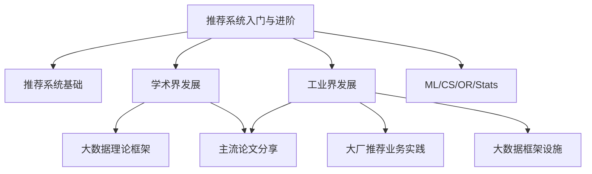

# Introduction

 

我喜欢把自己看成一位推销员、一位销售。  

相比于费尽口舌也不能说服顾客购买自己的产品，计算广告和推荐系统却能让顾客在无意之中为自己买单，理想很美好，现实却是由于与业务联系密切，我们往往缺少时间磨练自己的推销艺术。

在这里，希望我们可以不去想实际工作中碰到的各种数据上的bug，不去和前后端对接不用和产品争辩，可以安心地留下一块净土去积累、思考，希望许许多多像我一样的new grad能够慢慢成长为有独立思考能力的工程师，希望这里可以成为这样一个平台。

我将会更新平日的阅读积累，同步工作中的一些问题，结合个人思考把广告推荐等相关知识在这里分享出来。如有侵权，请联系owner删除：
* Email: czy466077978@gmail.com

 

#### 最近更新：已将美团技术团队的相关内容同步

 

#### 后续安排：对论文进行细分，对博客进行重要性打分，在仓库中添加个人阅读笔记

 

#### 相关资源参考：
 

* [美团技术团队](https://tech.meituan.com/)
* [推荐系统相关论文和资源列表](https://github.com/wzhe06/Reco-papers)

 

----------------------------
 

## 学习路线大纲
 

若思维导图无法正常显示，请下载 [github-mermaid-extension](https://github.com/BackMarket/github-mermaid-extension#install)

---

## 目录

 

以下内容按时间由近到远顺序排列。  

 

### 推荐系统基础 
 

2018.12
[深入浅出排序学习：写给程序员的算法系统开发实践](https://tech.meituan.com/2018/12/20/head-in-l2r.html)

 

### 学术界发展
 

* #### 大数据理论框架:

    + 2014.10
[Scaling distributed machine learning with the parameter server](https://www.usenix.org/system/files/conference/osdi14/osdi14-paper-li_mu.pdf)

    + 2008.06
[Bigtable: A Distributed Storage System for Structured Data](https://dl.acm.org/doi/pdf/10.1145/1365815.1365816)

    + 2004.10
[MapReduce: Simplified Data Processing on Large Clusters](https://static.googleusercontent.com/media/research.google.com/zh-CN//archive/mapreduce-osdi04.pdf)

    + 2003.10
[The Google File System](https://static.googleusercontent.com/media/research.google.com/zh-CN//archive/gfs-sosp2003.pdf)

 

* #### 主流论文分享：

    + 2020.10
[DCN V2: Improved Deep & Cross Network and Practical Lessons for Web-scale Learning to Rank Systems](https://arxiv.org/abs/2008.13535)

    + 2019.09
[Recommending what video to watch next: a multitask ranking system](https://dl.acm.org/doi/10.1145/3298689.3346997)

    + 2018.07
[Real-time Personalization using Embeddings for Search Ranking at Airbnb](https://dl.acm.org/doi/abs/10.1145/3219819.3219885)

    + 2018.07
[Modeling Task Relationships in Multi-task Learning with Multi-gate Mixture-of-Experts](https://dl.acm.org/doi/10.1145/3219819.3220007)

    + 2018.04
[Entire Space Multi-Task Model: An Effective Approach for Estimating Post-Click Conversion Rate](https://arxiv.org/abs/1804.07931)

    + 2018.02
[Latent Cross: Making Use of Context in Recurrent Recommender Systems](https://dl.acm.org/doi/10.1145/3159652.3159727)

    + 2017.06
[Deep Interest Network for Click-Through Rate Prediction](https://arxiv.org/abs/1706.06978)

    + 2017.03
[DeepFM: A Factorization-Machine based Neural Network for CTR Prediction](https://arxiv.org/abs/1703.04247)

    + 2016.11
[Product-based Neural Networks for User Response Prediction](https://arxiv.org/abs/1611.00144)

    + 2016.06
[Wide & Deep Learning for Recommender Systems](https://arxiv.org/abs/1606.07792)

### 工业界发展

 

* #### 大厂推荐业务实践:

    + 2021.07
[多业务建模在美团搜索排序中的实践](https://tech.meituan.com/2021/07/08/multi-business-modeling.html)

    + 2021.06
[SIGIR 2021 | 广告系统位置偏差的CTR模型优化方案](https://tech.meituan.com/2021/06/10/deep-position-wise-interaction-network-for-ctr-prediction.html)

    + 2020.08
[KDD Cup 2020多模态召回比赛亚军方案](https://tech.meituan.com/2020/09/27/kdd-cup-multimodalities-recall-02.html) [季军方案](https://tech.meituan.com/2020/09/27/kdd-cup-multimodalities-recall-03.html)

    + 2020.08
[KDD Cup 2020 Debiasing比赛冠军技术方案及在美团的实践](https://tech.meituan.com/2020/07/09/bert-in-meituan-search.html)

    + 2020.07
[BERT在美团搜索核心排序的探索和实践](https://tech.meituan.com/2020/07/09/bert-in-meituan-search.html)

    + 2020.04
[Transformer 在美团搜索排序中的实践](https://tech.meituan.com/2020/04/16/transformer-in-meituan.html)

    + 2019.01
[深度学习在搜索业务中的探索与实践](https://tech.meituan.com/2019/01/10/deep-learning-in-meituan-hotel-search-engine.html)

    + 2019.01
[大众点评搜索基于知识图谱的深度学习排序实践](https://tech.meituan.com/2019/01/17/dianping-search-deeplearning.html)

    + 2018.11
[知识图谱的建模方法及其应用](https://tech.meituan.com/2018/11/01/meituan-ai-nlp.html)

    + 2018.06
[深度学习在美团搜索广告排序的应用实践](https://tech.meituan.com/2018/06/07/searchads-dnn.html)

    + 2018.03
[美团“猜你喜欢”深度学习排序模型实践](https://tech.meituan.com/2018/03/29/recommend-dnn.html)

    + 2017.07
[深度学习在美团推荐平台排序中的运用](https://tech.meituan.com/2017/07/28/dl.html)

    + 2017.06
[美团点评旅游搜索召回策略的演进](https://tech.meituan.com/2017/06/16/travel-search-strategy.html)

    + 2017.05
[美团DSP广告策略实践](https://tech.meituan.com/2017/05/05/mt-dsp.html)

    + 2017.03
[旅游推荐系统的演进](https://tech.meituan.com/2017/03/24/travel-recsys.html)

    + 2016.04
[Online Learning算法理论与实践](https://tech.meituan.com/2016/04/21/online-learning.html)

    + 2016.03
[深入FFM原理与实践](https://tech.meituan.com/2016/03/03/deep-understanding-of-ffm-principles-and-practices.html)

    + 2015.01
[美团推荐算法实践](https://tech.meituan.com/2015/01/22/mt-recommend-practice.html)

 

* #### 大数据框架设施:

    + 2021.04
[美团酒旅数据治理实践](https://tech.meituan.com/2021/04/15/data-governance-in-meituan-jiulv.html)

    + 2021.03
[美团外卖特征平台的建设与实践](https://tech.meituan.com/2021/03/04/featureplatform-in-mtwaimai.html)

    + 2020.01
[一站式机器学习平台建设实践](https://tech.meituan.com/2020/01/23/meituan-delivery-machine-learning.html)

    + 2018.10
[基于TensorFlow Serving的深度学习在线预估](https://tech.meituan.com/2018/10/11/tfserving-improve.html)

    + 2018.03
[每天数百亿用户行为数据，美团点评怎么实现秒级转化分析？](https://tech.meituan.com/2018/03/20/user-funnel-analysis-design-build.html)

    + 2017.09
[人工智能在线特征系统中的生产调度](https://tech.meituan.com/2017/09/22/online-feature-system02.html)

    + 2017.07
[人工智能在线特征系统中的数据存取技术](https://tech.meituan.com/2017/07/06/online-feature-system.html)

    + 2016.12
[外卖排序系统特征生产框架](https://tech.meituan.com/2016/12/09/feature-pipeline.html)

 

### ML/CS/OR/Stats
 

2021.01
[速度与压缩比如何兼得？压缩算法在构建部署中的优化](https://tech.meituan.com/2021/01/07/pack-gzip-zstd-lz4.html)

2020.05
[美团配送A/B评估体系建设实践](https://tech.meituan.com/2020/05/28/peisong-a-b-test.html)

2020.02
[美团智能配送系统的运筹优化实战](https://tech.meituan.com/2020/02/20/meituan-delivery-operations-research.html)