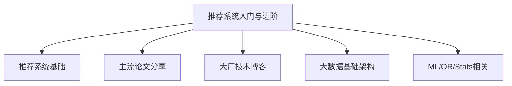

# Introduction

 

我喜欢把自己看成一位推销员、一位销售。  

相比于费尽口舌也不能说服顾客购买自己的产品，计算广告和推荐系统却能让顾客在无意之中为自己买单，理想很美好，现实却是由于与业务联系密切，我们往往缺少时间磨练自己的推销艺术。

在这里，希望我们可以不去想实际工作中碰到的各种数据上的bug，不去和前后端对接不用和产品争辩，可以安心地留下一块净土去积累、思考，希望许许多多像我一样的new grad能够慢慢成长为有独立思考能力的工程师，希望这里可以成为这样一个平台。

我将会更新平日的阅读积累，同步工作中的一些问题，结合个人思考把广告推荐等相关知识在这里分享出来。如有侵权，请联系owner删除：
* Email: czy466077978@gmail.com

 

##### 最近更新：

 

##### 相关资源参考：

* [美团技术团队](https://tech.meituan.com/)
* [推荐系统相关论文和资源列表](https://github.com/wzhe06/Reco-papers)

 
 

### 学习路线大纲
 
 

 

### 目录