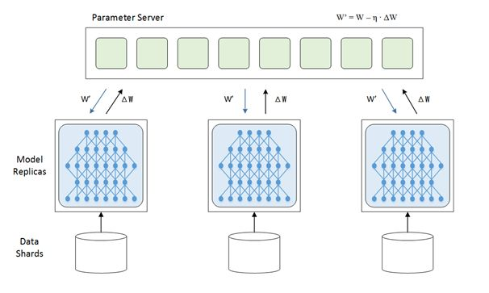
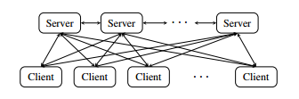
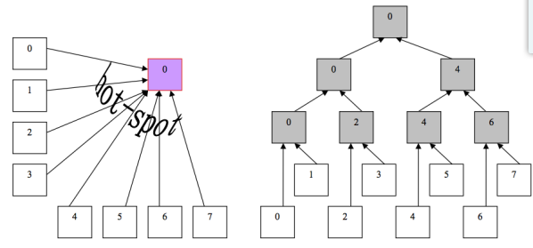
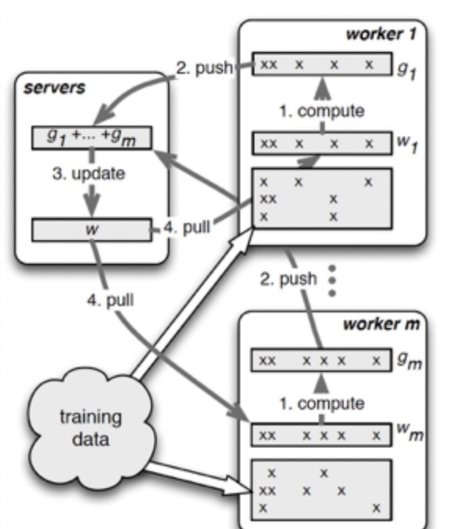

## 前言
最近对分布式起了点兴趣，虽然目前工业界整体的架构已经在N年前已经奠定好了基础，之后的一些框架也只是在之前的框架进行本地化的改良，但不管怎么说，了解分布式、知道分布式的基础也是工作中必不可少的一环，下面就结合理论、实践和个人体会漫谈distributed machine learning。

## 背景知识
首先说一下分布式，分布式和集群有什么区别？简单来说集群是个物理形态，比如堆一堆机器、HPC一类的，就可以说是集群，它们并不一定在一起干活；分布式呢，一个系统或是任务，运行在不同的机器上，机器也不必物理集中，就叫分布式。一个集群中是否有分布式架构是不一定的，分布式任务运行在一个或者多个集群中也是可能的。更抽象一点，分布式是指通过网络连接的多个组件，通过交换信息协作而形成的系统。而集群，是指同一种组件的多个实例，形成的逻辑上的整体，两者并不冲突。

分布式结构有什么好处呢？我们先继续推架构，从单机到集群再到微服务，再到分布式，不同架构上的代码有什么变化呢？首先，单机和集群的代码是基本相同的，集群不过是每台机器上重复了单机的代码，但是微服务架构（国内经常提的spring cloud全家桶进行组件提供）的代码就会产生比较大的变化了，将不同的功能单元进行拆分便于维护，我们也逐渐成为了流水线上的工人。而所谓的分布式结构就是将一个完整的系统，按照业务功能，拆分成一个个独立的子系统，在分布式结构中，每个子系统就被称为“服务”。这些子系统能够独立运行在web容器中，它们之间通过RPC方式通信（内部框架训练的时候就看到过RPC failed，有兴趣的可以自己了解一下RPC，之后我可能也会专门写一个RPC框架的认知）

这样做的好处，用知乎上看到的一个例子：假设需要开发一个在线商城。按照微服务的思想，我们需要按照功能模块拆分成多个独立的服务，如：用户服务、产品服务、订单服务、后台管理服务、数据分析服务等等。这一个个服务都是一个个独立的项目，可以独立运行。如果服务之间有依赖关系，那么通过RPC方式调用。

## 并行方式
我们有逻辑地来介绍一下分布式训练，第一个是why，为什么要这么做？目前的深度学习领域就是海量的数据，比如TB甚至PB级的数据再加上大量的数学运算，训练一个模型跑上十天半个月啥的是常事。那此时分布式的意义就出现了，既然一张GPU卡跑得太慢就来两张，一台机器跑得太慢就用多台机器，这就是我们俗称的单机多卡和多机多卡，后面进而用分布式训练。

第二个是How，既然是分布式，那它是怎么做的？主要分为两类，数据并行和模型并行，从字面就可以看出是parallel，由于是多机完成同一个task，因此是分布式的。在工业场景的实践中，分布式模型训练也会采用不同并行方式的组合，例如数据并行与模型并行结合，数据并行与流水线并行结合等。其中数据并行的应用范围最广，像搜索、推荐领域的深度学习模型，通常都是采用数据并行的方式进行切分的，而后面讲到的飞桨paddle分布式训练的几种架构方案中，基本都采用了数据并行方式，然后再与其它并行方式配合使用。

    
     
    

      数据并行
  	

在数据并行中，被划分的是数据，所以这种并行方式叫数据并行。
 

    
     
    

      模型并行   
  	

深度学习的计算其实主要是矩阵运算，而在计算时这些矩阵都是保存在内存里的，如果是用GPU卡计算的话就是放在显存里，可是有的时候矩阵会非常大以至于显存塞不下。这个时候就不得不把这样的超大矩阵给拆了分别放到不同的卡上去做计算，模型并行从网络的角度来说就是把网络结构拆了，其实从计算的过程来说就是把矩阵做了分块处理。

## 参数更新方式
虽然训练任务可以拆分，但是在一个Batch的数据训练完成后，下一个Batch的数据训练开始之前，必须先更新Worker上的模型参数，因此模型参数的更新传递是分布式训练中非常重要的一环，模型参数信息的传递方式和更新频率都会直接影响模型的最终效果，参数更新频率是指以什么样的节奏更新参数。这同样有两种方式，一个是同步，即所有Worker节点，共同完成一个Batch的数据训练后统一更新，另一个是异步，每个Worker节点，完成自己负责的数据部分的训练后，就直接开始更新参数。

我们先来聊聊同步，随着互联网发展已经衍生出了很多的分布式计算的idea，比如mapreduce、mpi等，它们都类似于同步的数据计算方法，即map和reduce阶段的计算速度都依赖最慢的机器的运行速度（木桶理论）。More specifically，mapreduce中的map阶段先将数据进行划分，再通过SGD进行梯度更新，每个worker之间虽然有一定的通信机制，但是通信并不是实时更新的，所以每一个worker并不知道对方的梯度是多少，因此在梯度的更新中势必会有很多的冗余迭代，最后才是负责reduce的服务器进行输出。同步训练最经典的就是allreduce算法，所有的worker读取mini-batch的不同部分，同步计算损失函数的gradient，最后将每个worker的gradient整合之后更新模型，问题就是我们上面说的存在很大浪费，百度2017年提出的Ring Allreduce是当前的SOTA，对计算资源和方法进行和很大的改良。

另一个就是异步训练，最著名的就是parameter server（简称PS），参数服务器架构是一种中心化架构，该架构采用将模型参数进行中心化管理的方式实现模型参数的更新和分发，它是由client和server组成的，client对应worker，负责计算。server是负责统一所有的client它们的参数，server间是联通的，具体见下图：

PS的优势是通过server来协同client的输出，它可以协同每一个client进行无重复的梯度下降，从而提高了效率。整个架构分为两大部分：server group和多个worker group，另外resource manager负责总体的资源分配调度。各自的职能分别如下：

* server group内部包含多个server node，每个server node负责维护一部分参数，server manager负责维护和分配server资源。

* 每个worker group对应一个application（即一个模型训练任务），worker group之间，以及worker group内部的worker node互相之间并不通信，worker node只与server通信。

这边再具体看几个架构细节：

##### 1. 并行化设计

+ 首先在client端，计算和上传数据是采用的多线程机制，计算和数据传输在不同的线程中进行从而增加了效率。同时server并不是等待所有参数都上传完成，才向下分发的。如果一个client_a计算比较慢，server可以暂时不采用client_a的数据，而采用历史数据。
+ 数据上传也可以用树状结构代替直接上传，在client和server之间增加一层树状结构可以提高数据传输效率，节约server的处理资源。可以从下图的左边，变为右边。

##### 2. pull和push机制

+ 一个问题是在client端应该上传怎样的数据，因为每个client节点都会不停的接受和反馈数据给server，那么到底应该push怎样的数据上去呢？这个一般来讲是选择步长最长的参数，也就是最大的梯度值的参数push上去，别的节点下次训练用到该参数时会直接从server上pull下来。
+ 总结一下，push：worker节点利用本节点上的训练数据，计算好局部梯度，上传给server节点；pull：为了进行下一轮的梯度计算，worker节点从server节点拉取最新的模型参数到本地。

当然，PS其实还有很多实现细节，比如使用一致性哈希方法来保证各个server各自负责一部分Key等等，这部分有兴趣的同学可以自行了解。最后总结下整个PS的分布式训练流程：

1.每个worker载入一部分训练数据。
2.worker节点从server节点pull最新的全部模型参数。
3.worker节点利用本节点数据计算梯度。
4.worker节点将梯度push到server节点。
5.server节点汇总梯度更新模型。
6.goto step2 直到迭代次数上限或模型收敛。

## 参考文献
【1】Mu Li. Scaling Distributed Machine Learning with the Parameter Server.
【2】Joseph E.Gonzalez. Emerging Systems For Large-scale Machine Learning.